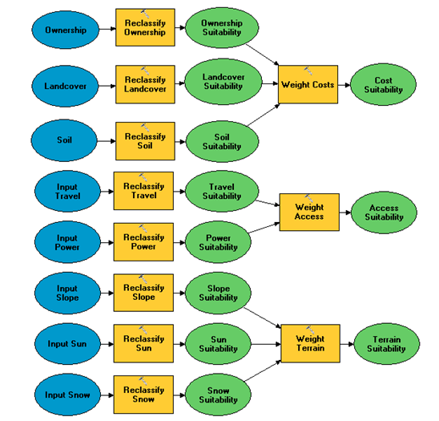
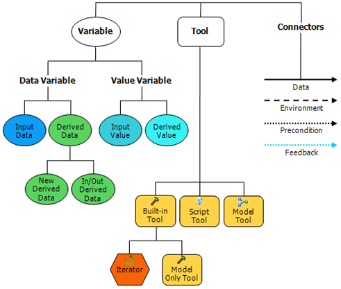
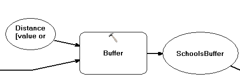
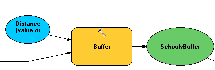
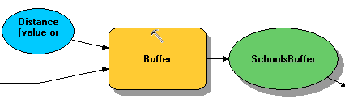
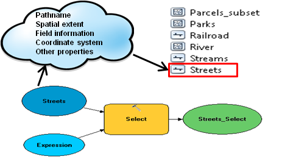
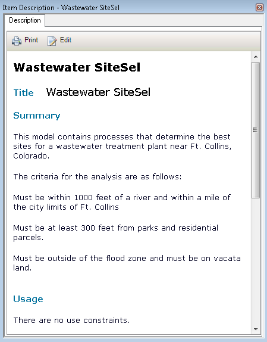
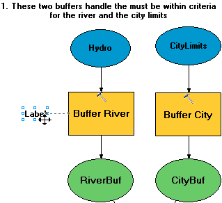
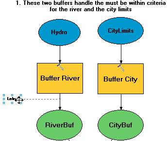

#Building Models for GIS Analysis Using ArcGIS
##Introduction
ArcGIS has many analysis and geoprocessing tools that can help you solve real-world problems with your data. In some cases, you are able to run individual tools to complete an analysis. But sometimes you may require a more comprehensive way to create, share, and document your analysis workflow.

In these situations, you can use a built-in application called ModelBuilder to create a workflow that you can reuse, modify, save, and share with others.

In this course, you will learn the basics of working with ModelBuilder and creating models. Models contain many different elements, many of which you will learn about. You will also learn how to work with models that others create and share with you. Sharing models is one of the major advantages of working with ModelBuilder and models in general. You will learn how to prepare a model for sharing by setting various model parameters.

##Introduction to models and ModelBuilder
GIS models are used for many applications. If you are using a map then you are using a `model`1, because maps represent real-world features. In this course, you will focus more on `geoprocessing`2 models that help you analyze the world and create new data. The first section will discuss model basics, which will get you started with using `ModelBuilder`3. You will learn what models are and the various elements and states of models that are available. You will also learn how to decipher models that colleagues or other users have created.

The following video demonstrates a model used in a parcel owner notification application.

>**Model**1: An abstraction of reality used to represent objects, processes, or events; in geoprocessing in ArcGIS, one process or a sequence of connected processes created in ModelBuilder.

>**Geoprocessing**2: A GIS operation used to manipulate GIS data. A typical geoprocessing operation takes an input dataset, performs an operation on that dataset, and returns the result of the operation as an output dataset. Geoprocessing allows for definition, management, and analysis of information used to form decisions.

>**ModelBuilder**3: The interface used to build and edit geoprocessing models in ArcGIS.

###What is a model?
The term model, as used in GIS, can have several meanings. Fundamentally, a model is an abstraction of reality used to represent an object, a process, or an event. In the context of geoprocessing, a model is one process or a sequence of connected processes created in ModelBuilder. In this course, you will concentrate on geoprocessing models and how they can facilitate your analysis operations and workflows.

For you—a GIS user—a model can be as simple as a feature used to represent a real-world object, a map, or an analysis workflow. This course will show you how you can use a model to create an analysis workflow that can be reused or shared. The following graphic illustrates some examples of models used in GIS.

![alt text][F1]
[F1]: lab1_data/misc/FeaturesModel.png "Logo Title Text 2"
**Figure 1**: this model contains polygons representing land annexation over time in Ft. Collins, Colorado. The use of polygons to represent real-world features is characteristic of GIS models, even if a model seems to lack greater complexity.

![alt text][F2]
[F2]: lab1_data/misc/Volcano.png "Logo Title Text 2"
**Figure 2**: This 3D model of a volcano could be used in a process to represent an eruption.

![alt text][F3]
[F3]: lab1_data/misc/Ozone.png "Logo Title Text 2"
**Figure 3**: This model represents ozone levels in California that were captured at each of the point locations in the map.

![alt text][F4]
[F4]: lab1_data/misc/Already_Run.png "Logo Title Text 2"
**Figure 4**: This model was created in ModelBuilder. This type of model is common in GIS and can be used to represent a process or analysis workflow. But there are other types of models that you can use in ArcGIS, as well.

###What is ModelBuilder and why use it?
To create a geoprocessing model in ArcGIS, you need to use the ModelBuilder application. ModelBuilder is a visual programming language—a language that enables you to create a program without writing code. You create this program by adding data and tool elements to the model and connecting them to form a workflow. ModelBuilder is a built-in application in ArcGIS designed for creating reusable and sharable geoprocessing workflows.
Following are some examples of models that have been built using ModelBuilder to perform various types of geoprocessing.
![alt text][F5]
[F5]: lab1_data/misc/Iterator.png "Logo Title Text 2"

**Figure 5**: This model was created in ModelBuilder. This type of model is common in GIS and can be used to represent a process or analysis workflow. But there are other types of models that you can use in ArcGIS, as well.

**Figure 6**: This model uses Spatial Analyst tools to analyze raster data for a ski resort suitability analysis.

######The following table lists some of the numerous advantages of building models in ModelBuilder:

|Why create a model in ModelBuilder?|
|---|
|To see a visual representation of analysis and geoprocessing operations|
|To automate and manage geoprocessing workflows|
|To run a complex succession of processes as one tool|
|To plug in additional tools and parameters as needed|
|To be able to share geoprocessing workflows with other users by sending them the model you've created in ModelBuilder|

###Model elements

In ModelBuilder, you add data and elements to your model and connect them in a processing workflow. The three basic types of elements you can add to models are: `variables`4, tools, and connectors. In any given situation, you may not use all these element types, but you will always use at least some of them.
The following graphic illustrates the various types of elements you can add to any model.

**Figure 7**: Variables, tools, and connectors are the three basic model elements. Variables are either data or value variables. A data variable is input or output (derived). An example of a value variable is buffer distance. Tools can be common system tools, script tools, model tools, or custom tools. Connectors can be a simple data connector, an environment setting, a precondition, or feedback.

[More about model elements](lab1_data/misc/ModelElements.md).

>**Variables**4:Values in a model that might change, such as input data, buffer distance, or SQL expressions.

###Model states
A single model process represents a tool, its input data, and its derived data. Although you can run an entire model at one time, you can also run individual processes of a model as needed. For example, you may need to run a tool before you can add the derived data to the next tool. It's important to understand model states: by looking at a model, you can tell what has or hasn't been run—and what might not be ready to run because of an error.
Models represent a continuous geoprocessing workflow, so processes that occur later in the model depend on processes that occur in the beginning. Why does this occur? The processes at the beginning create or modify data that is used in future processes.

Knowing about model states can help you make sure that your models are ready to run and will run as expected.

**Figure 8**: **_Not ready to run_**. When model elements are white, they are NOT ready to run. The reasons for elements not being ready to run are varied. Maybe a tool parameter isn't properly set, or maybe the input data is incomplete, corrupt, or has some other problem.

**Figure 9**: **_Ready to run_**. Model elements that are displayed in color are ready to run. The parameters for these elements have all been properly set.

**Figure 9**: **_Already run_**. The shadow, or shading, behind a model element indicates that the element has already been run. Only tool and derived data elements will display a shadow. Input data elements won't display a shadow because these elements are used only to produce derived data.

###Model environment settings

`Environment settings`5 are additional parameters you set before running a tool. For example, you might want to set an output geodatabase for running several tools, or to set a cell size for the analysis output of a raster dataset. Environment settings affect the tool's result.

Environment settings can make running a tool easier. With environment settings, you can be sure that the proper settings are in place for a tool to be run. For example, you can specify the output geodatabase where you want all derived data to be stored, the output coordinate system, and the processing extents in your map. You set these settings in a separate dialog box, and when you run a tool, ArcGIS knows the environments and applies them to the tool and output.

Environment settings have a hierarchical structure and can be overridden at some levels. The following table describes these levels.

|Environment Setting Type	|Description|Override Characteristics|
|---|---|---|
|**Application level**		|Set in Geoprocessing > Environments menu; applied to all tools	|Become the default settings after being set; will be applied to any tool executed|
|**Tool level**|Set in each individual tool dialog box; pertain to that tool only		|Applied to a single run of a tool; override application-level settings|
|**Model level**|Set in model properties; pertain to tools within that model	|Override tool-level and application-level settings|
|**Model process level**		|Set in each model process		|Override all other levels|

>**Environment setting**5: Additional parameters that affect a tool's result. Environment settings are set separately from the tool parameters before running the tool and are used during the tool's execution.

 
***
###Exercise 1: Explore an existing model
1. Download data for this lab from [here](lab1_data/BldgModels10_0.exe), then click the **Download** botton.
2. Double click the dataset and install the data into U:\Student.
3. There will be an error when running the model in Step 7. To solve it, change the paths of variable ***SchoolBuffer***, ***gMainBuffer***, ***Intersect (2)***, and ***GasLeakAreas*** from 'C:\ ...' to 'U:\ ...'

4. Then complete the exercise following the instruction [here](lab1_data/misc/Exercise1.pdf).

>**Tip**: You may want to download the exercise pdf in order to copy the text in it, as well as the following exercises.

***
##Creating and using models

Earlier in the course, you learned some basic information about models. You also learned how to decipher a model that has already been built. In this section, you will learn how to create new models from scratch and how to set up tool and model parameters. Creating your own models expands your geoprocessing and analysis options—options that often don't exist when you run single tools in succession.

The following video demonstrates a model being built from scratch.

###Planning your analysis

When you are performing some type of GIS analysis or completing a data management project and you want to use ModelBuilder, you should consider the following questions before placing a single element in your model.

|Questions to consider before building a model|
|---|
|What is the goal of the model you want to build?|
|What data do you need to use in the model?|
|What is the most effective workflow to follow to achieve your goals?|
 
If you're planning to build a model, you can follow this set of guidelines to help you determine goals, data, and tools before you start building.

|ModelBuilder planning guidelines|
|---|
|Determine the scenario and criteria for analysis or data management, and set goals for your model.|
|Explore and gather necessary data. This may involve creating and editing data.|
|Choose tools that will enable you to achieve your goals. This requires thoroughly understanding your goals and the tools you'll use.|
|Build and run a model. By this time, you have already determined everything you need to complete your model.|
|Explore and refine the results of your model. You might view, analyze, and symbolize your results to determine whether they are satisfactory. You can run the model again with different tool inputs, if needed.|
 
***
###Exercise 2: Prepare for your analysis
Please complete the exercise following the instruction [here](lab1_data/misc/Exercise2.pdf).
***

###Exploring tool and model parameters

When you run a geoprocessing tool in ArcGIS—either on its own or as part of a model—you must enter parameters. A parameter is a tool property you need to determine before running the tool. Examples of tool parameters include input and output datasets.

When you work with models, you still need to enter tool parameters for each tool in your model, but you can also create something called a `model parameter`6.

The following video will demonstrate tool and model parameters.

>**Model parameter**6: In ArcGIS, a type of parameter exposed in a geoprocessing model that appears in a model's dialog box and allows for input.

###Working with intermediate data

When a model is executed, new data is usually created. Even a model with only two processes will potentially create two new datasets. In most cases, the only dataset you need to keep is the final output of the model after all its processes have been run to create that final output.

But after a model runs, other datasets are created from each model process and then fed into the next tool to create more data, ultimately leading to the creation of the final dataset. These datasets, which will not be maintained after the processes run, are called `intermediate data`7.

Managing intermediate data usually needs to be done manually. ModelBuilder automatically flags all derived datasets within a model as intermediate data (except the final output). You decide to either keep or delete intermediate data after you run your model. Most likely, you will delete intermediate data because these datasets were only created as steps toward creating the final output (think of intermediate data as being used only as intermediate steps). Intermediate data takes up space in your geodatabase. If you want to keep intermediate data as a record of your model's history, you can use the scratch workspace environment setting to store it, and still store your final result in the current workspace.

When you run a model from ModelBuilder, intermediate data remains: you need to delete it manually from the Model menu option. If you run the model from its tool dialog box, intermediate data is automatically deleted.
>**intermediate data**7: Any data in a process that did not exist before the process existed and that will not be maintained after the process executes.

###Validating and running your model

Once you add model elements to ModelBuilder and connect them to tools to form processes, it is good practice to validate the model before you run it. A number of problems can occur with your model—problems that might show up as errors when you execute the model: incorrect parameters, nonexistent data, or improper value variables for a specific tool, for example. Validating the model can identify these and other problems.

Suppose a data variable represents a feature class (see the example shown in the following graphic). The data variable contains the path to the data on disk, a list of information about all the fields, and other information used only by geoprocessing tools. Validation ensures that the tool is ready to run.

**Figure 9**: The shadow, or shading, behind a model element indicates that the element has already been run. Only tool and derived data elements will display a shadow. Input data elements won't display a shadow because these elements are used only to produce derived data.

If all elements and parameters are properly validated, the elements will be set as ready to run.

>**Tip**: If you are sent a model by a colleague, for example, and the model's derived data and tools have shadows (indicating that they have already been run), you can validate the model to remove the shadows and rerun it.

###Documenting your model

As you have already learned, creating a model is essentially creating a geoprocessing or analysis workflow that you can reuse or share with others. It is therefore good practice to document your model: documenting it enables you and others to understand it more easily at a later date.
Think of documenting a model as creating metadata (data about the model). In ArcGIS 10, you can create an item description to help others understand the processes you used in your model, allowing them to use the model more easily.
You can add labels to the model itself that show the workflow and describe a particular tool, data element, or process. Labels can be placed freely in the model or can be added for a particular element (tool, variable, connector) and tied to it.

**Figure 10**: An example of a typical item description for a model.

**Figure 11**: An example of a free-floating label on top in bold text and a tool label.

**Figure 12**: An example of a connector label.

 
***
###Exercise 3: Exercise: Build a site selection model
**Please complete the exercise following the instruction [here](lab1_data/misc/Exercise3.pdf).**
***

###Exercise 4: Run the model and work with parameters (Optional)
**Completing this exercise is optional, but recommended. Access to the instruction from [here](lab1_data/misc/Exercise4.pdf).** 
***