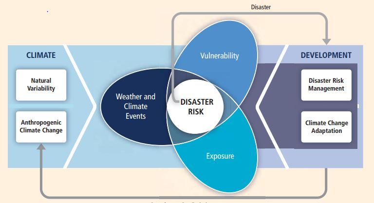
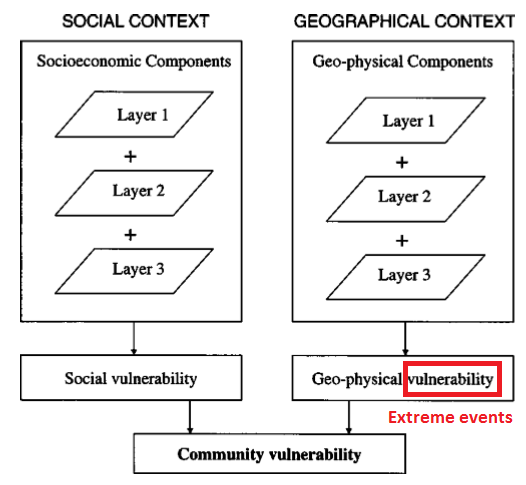
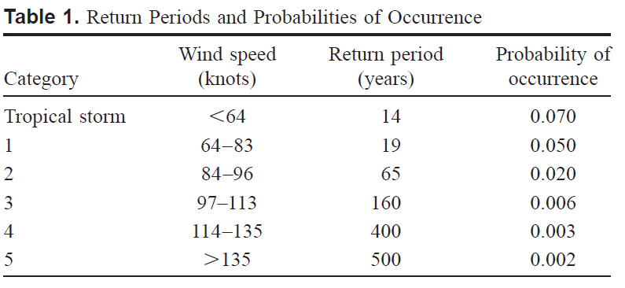
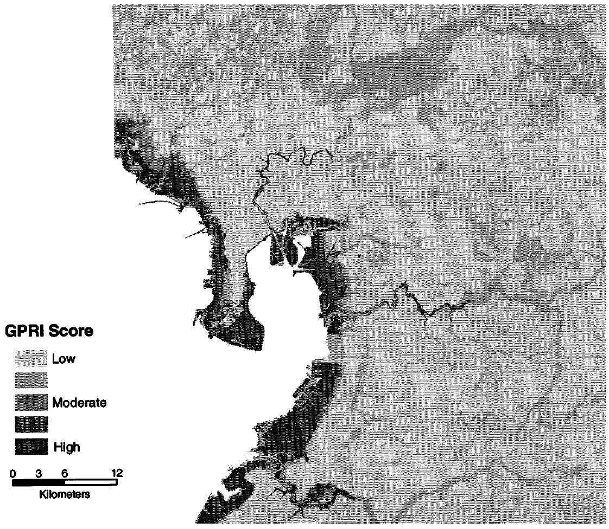
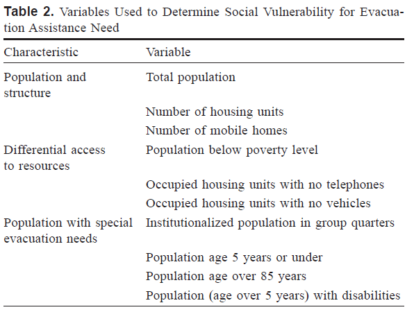
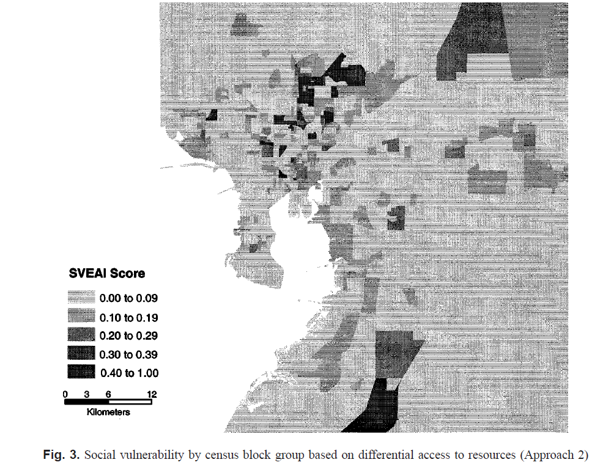
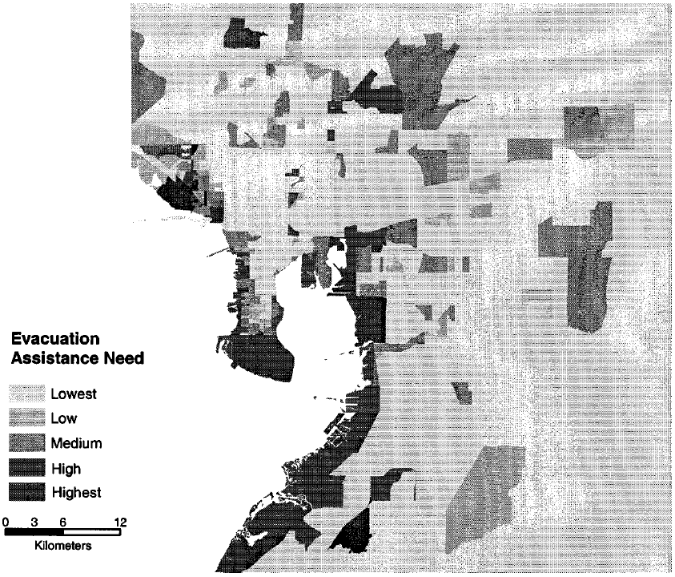
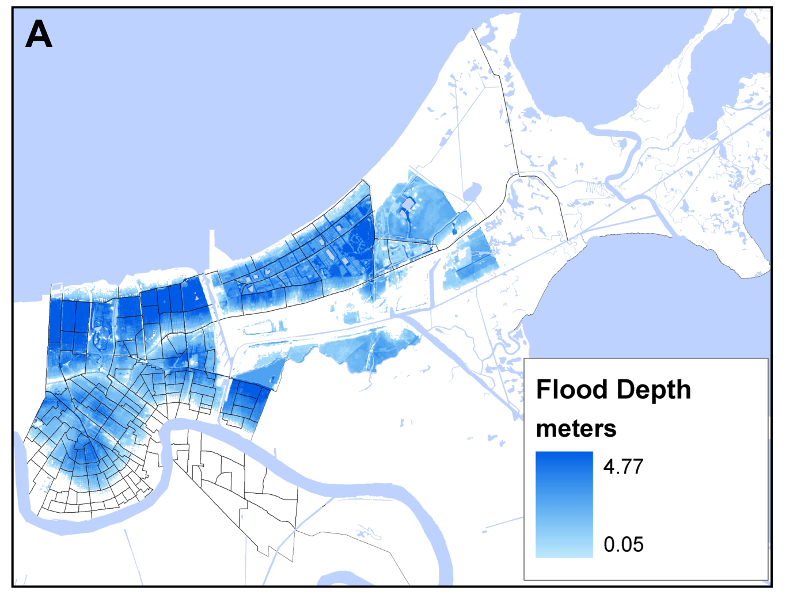
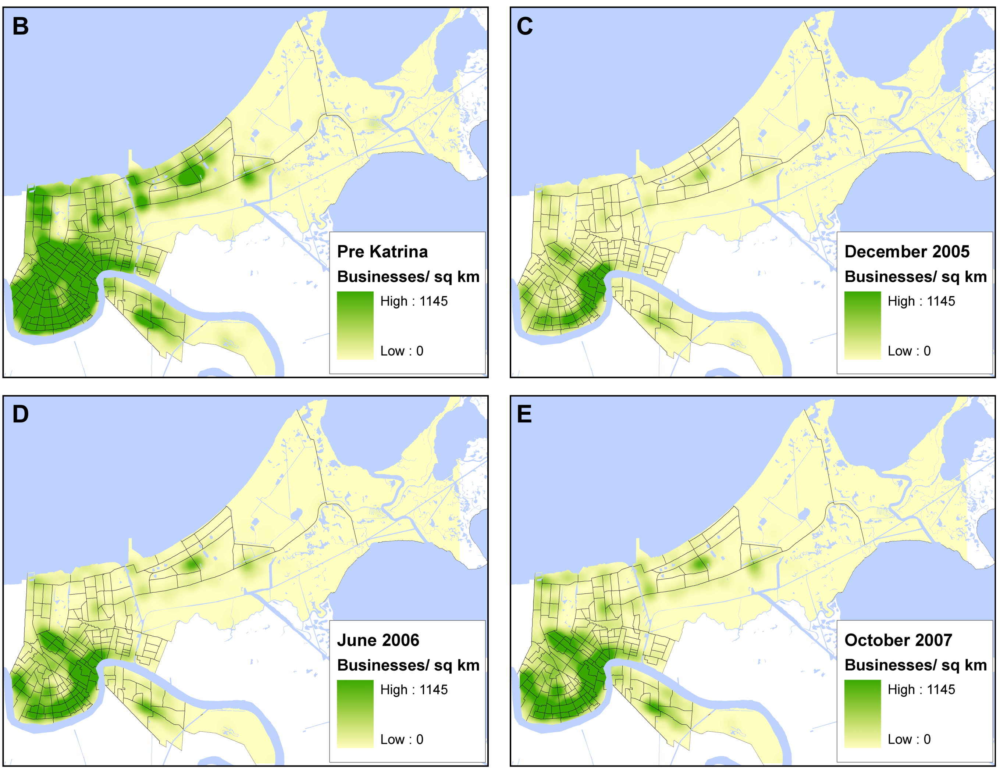
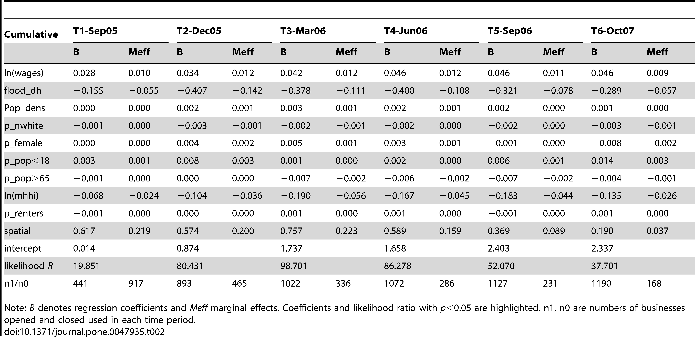

Week 11: Disaster Risk and Vulnerability
========================================================
author: Yi Qiang
date: Mar. 24, 2017
autosize: true
font-family: 'Helvetica'
css: style.css

Disaster Risk
========================================================
Risk = Extreme event * Exposure * Vulnerability

Last Week
=======================================================
- Extreme event
  - Sea level rise
  - 100-year-flood
- Exposure
  - population impacted by sea level rise
  - Population/urban in 100-year-flood zone
- Vulnerability (resilience)
  - Social vulnerability index (SoVI)
  - Baseline Resilience Indicators for Community (BRIC)

Case Study 1
======================================================
Chakraborty, J., Tobin, G. a., & Montz, B. E. (2005). Population Evacuation: Assessing Spatial Variability in Geophysical Risk and Social Vulnerability to Natural Hazards. *Natural Hazards Review*, 6(1), 23-33. 

<iframe src="https://www.google.com/maps/embed?pb=!1m18!1m12!1m3!1d902407.3157811725!2d-82.94101806786689!3d27.931769160912012!2m3!1f0!2f0!3f0!3m2!1i1024!2i768!4f13.1!3m3!1m2!1s0x88dd3512570a8e95%3A0xdb3a212adf1af30c!2sHillsborough+County%2C+FL!5e0!3m2!1sen!2sus!4v1490081788207" width="600" height="450" frameborder="0" style="border:0" allowfullscreen></iframe>

GIS-base Vulnerability Assessment
========================================================
### Using GIS to overlay social vulnerability and potential occurrence of extreme event 

Geophysical risk component (extreme event)
========================================================
- Probability of Hurricane (National Hurricane Center Risk Analysis Program)
- Probability of Flood (100-year-flood zone)
- A geophysical risk index (GPRI) was derived by summing the two individual probabilities. 

Mapping geophysical risk index (extreme event)
========================================================

Social Vulnerability
========================================================
#### Standardize variables into [0,1] and sum them up into a vulnerability index

Social Vulnerability
========================================================
#### Spatial distribution of social vulnerability

Overall Evacuation Assistance Need
========================================================
### Geophysical risk (extreme event) $\times$ social vulnerability

Business Return after Katrina (Resilience Assessment)
========================================================
Lam, N. S. N., Pace, K., Campanella, R., LeSage, J., & Arenas, H. (2009). Business Return in New Orleans: Decision Making Amid Post-Katrina Uncertainty. *PLoS ONE*, 4(8), e6765.  

Recovery after Katrina
========================================================

Business Return after Katrina (Resilience Assessment)
========================================================
#### Data were collected by phone interview and street survey.

Regression analysis (Finding factors for business return)
========================================================
#### Socio-economic variables significantly related to business return

New Methods for vulnerability/resilience assessment
======================================================
### Social media data: Time series of check-ins in Four Square  

- What people think (perception) during/after disaster

<iframe width="560" height="315" src="https://www.youtube.com/embed/g3AqdIDYG0c" frameborder="0" allowfullscreen></iframe>

Brief Review of GEOG489
=======================================================
1. ModelBuilder and Python scripting in ArcGIS (week 1&2)
2. Suitability modeling (week 3&4)
3. Land cover change modeling (week 5&6)
4. Terrain Analysis (week 7&9)
5. Disaster risk and vulnerability assessment (week 10& 11)

Topic 1. ModelBuilder and Python scripting in ArcGIS
=======================================================
- Create, save and share complex workflow of GIS modeling
- ModelBuilder (Graphic Interface)
  - Variables
  - Parameters
  - Processing tools
- Python script (Programming interface)
  - Interactive console
  - Script editor
  
Topic 2. Suitability Modeling
=======================================================
1. 1. Selecting criteria
2. 2. Mapping criteria: Binary and Continuous (reclassify)
3. 3. Standardization
4. 4. Determine relative importance (weight) of criteria
5. 5. Combining criteria (addition, multiplication)
- Raster and vector approaches

Topic 3. Land cover change modeling
=======================================================
- 1. Data processing
  - Making data comparable at different time points
- 2. Change Detection (Exploratory analysis)
  - Urban growth, deforastration rate, patterns
  - Transition matrix
- 3. Change Modeling (Empirical modeling)
  - Building relation between change and other variables - Regression model, data mining
- 4. Change Modeling (predictive modeling)
  - Cellular automata
  - Urban sprawl (neighborhood effect) and spill over (global suitability)

Topic 4. Terrain Analysis
=======================================================
- Two Digital Terrain Data Models - Digital Elevation Model (DEM) & Triangular Irregular Netowrk(TIN)
- Surface Adjusted Metrics (distance, area)
- Slope, aspect
- Profile
- Viewshed
- Hillshade
- Solar radiation

Topic 4. Terrain Analysis
=======================================================
- Watershed analysis
  - Pit/peak removal
  - flow direction
  - flow accumulation
  - Stream delineation
  - Watershed delineation

Next Topic: Web Mapping
=======================================================
- Workshop on April 24th, 9-11:30am
- No lab assignment for this topic
Before the class:
  - Create an ESRI account (or Google+, Facebook) 
  https://accounts.esri.com
  - Create a GitHub account
  https://github.com/

Project report and poster
=======================================================
- Both report and poster are due April 24 (**Monday**)
- Report following the tempate

Project report
=======================================================
- Report must **not** exceed 10 pages and should include:
  -	Introduction (~ 0.5 page): Background information and motivation of study
  -	Related work (~ 0.5 page): Brief discuss other work related to your project
  -	Methodology (1 page): Workflow of your study
  -	Results (1 page): Interpretation of the result
  -	Discussion (~ 0.5 page): Limitation of your study
  -	Conclusions and Future Work ( ~ 0.5 page).

Presentation and poster showing
=======================================================
- <=20 mins in total (<=15 mins for presentation and <=5 mins for Q&A and transition)
- April 28th 9-12am (9 presentations)
- Poster showing on May 5th (11-12am) in Geography Symposium

Lab 5. Risk and Vulnerability Assessment
========================================================
Assignment 

https://github.com/qiang-yi/GEOG489/blob/master/labs/lab5_sea_level_rise.docx

Due date: April 7
