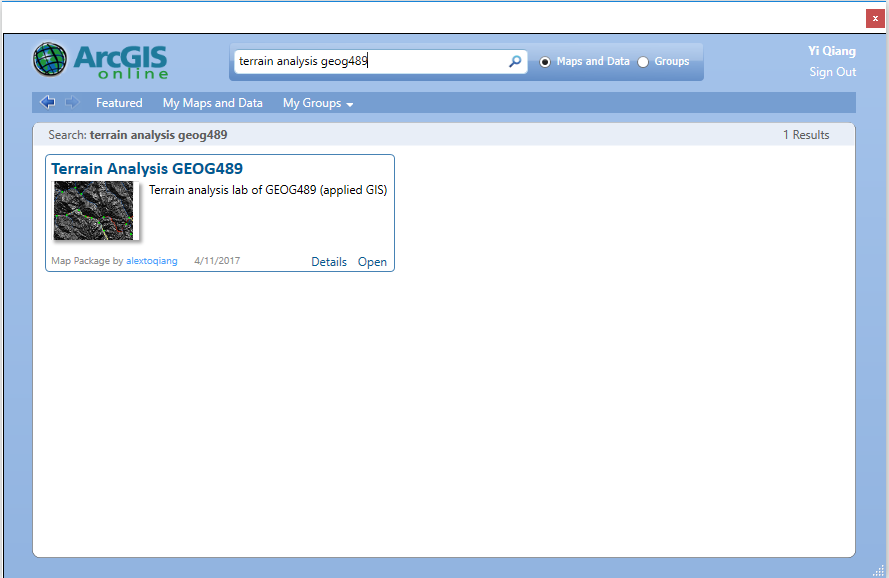

# Week 12: Web Mapping using ArcGIS online
Instructor: Yi Qiang
April 21,2017
Instruction URL: https://git.io/v9J5B
## 1. Sharing Maps using ArcGIS
### 1.1 Sharing a Map Package
Sharing a map package is the easiest way to share maps you created in ArcGIS with other ArcGIS users.
- Sharing your ArcGIS project (.mxd file) and associated datasets as a package
- The shared package can only be viewed in ArcGIS
- Require ESRI account and ArcGIS for both both side (uploader and downloader)

**Practice 1**: Share your lab 4 (terrain analysis) result as a package.
First, open the your Lab 4 exercise (.mxd file) in ArcGIS. If you don't have it, download it and unzip it from [here](https://github.com/qiang-yi/GEOG489/blob/master/labs/lab4_data/lab4_data.zip). Go to the 'File' menu, click **Share As -> Map Package**.
Choose **upload package to an ArcGIS online account**, then enter your username and password in the **ArcGIS Sign In** window. If you don't have an account yet, you can use your Facebook or Google+ account to log in.

 

After logging in, give an name to your package, for instance, Terrain Analysis GEOG489, then, click **Analysis** to see if there are any errors in the package before sharing.

 

You probably will see the following errors.

 

To solve them, you need to fill in the boxes of **Summary, Tags and Description**. Then, click **Analyze**, you will see all errors are gone. 

 

Go to the **Sharing** tab and check **Everyone (public)**. This is to make your package searchable and sharable to the public.

 

Now, you can close ArcGIS and open an empty ArcGIS file. Go to **File -> ArcGIS Online**, search for the tags you've enterred when creating the package (e.g. terrain analysis, GEOG489). You will find the package you've shared online. Other users can find your package in the same way. They can click **Open** to open it in ArcGIS.

 
To access your ArcGIS online account, you can go to http://www.arcgis.com. Log in with your password and username. You will see the map package you've shared in the dashboard of your account.

 
Click **My Content**, you can access to the dashboard of your account, where you can see all maps and packages in your account. You can click into the Terrain Analysis package to see detailed information and other options.

 

### 1.2 Creating a Web Map in ArcGIS Online
#### 1.2.1 Preparing datasets for uploading
Sharing map package is easy. However, it requires the other user to have ArcGIS and ESRI account to access your map, which is not always possible. An alternative way to share your map is creating a web map in ArcGIS online, which is accessible from any browsers in all devices (desktop, tablet and mobile phone).

Pros and cos of creating web map in ArcGIS online
- Neither ESRI user account nor ArcGIS is required for other people to access your map - all they need is a web browser
- You need to assemble and edit your map in ArcGIS online (in browser), which sometimes is not as convenient as ArcGIS desktop.
- Only support a part of functionalities of ArcGIS.  

**Practice 2**, Use ArcGIS online to create a web map that can be openned in any browser.

First, you need to upload datasets in your computer onto your ESRI account. Note vector data (shapefile) and raster data are uploaded in different formats. Shapefile should be compressed into zip file, while raster data need to be converted into KML format for uploading.

Let's compress vector data first. You need to compress all components (around 6 files) of the shapefile into a zip file. Please compress the shapefiles of road, city and stream in the Terrain Analysis lab into three separate zip files.

 

Then, convert raster data into KML format. You can search for the **To KML** tool in ArcGIS and use it to convert the DEM, hillshade and your final suitability map (if it is raster) into KML files. Set **Extent to Export** the same as the dataset itself.

 

#### 1.2.2 Upload the prepared datasets into ArcGIS online
Now, you have prepared your datasets in appropriate formats for uploading. The next step is creating a web map where you can add your datasets. Please go to the dashboard of your ESRI account (in **My Content** tab) and create a new map. This map is like an ArcGIS project (.mxd) where you can add datasets as layers. You can name it, add tags and summary. Open the newly created map.

 

In the created web map, click **Add -> Add Layer from File**, add the zip files of cities, road and stream shapefiles. You can try different symbol modes to see the difference.

 
Once the datasets are added, you can change their properties in the table of content. You can drag to move one layer above or below the other, which is very similar to the manipulation of data layers in ArcGIS. You can also change the base map or even edit features.

 
Adding raster layers is a bit tricky. You need to first go back to the ArcGIS online dashboard by click **ArcGIS Online -> Content**.

 
Then, click **Add Item -> From my computer** to add the raster files, which are in the KML format. 

 
Then, you will see these KML files appear in the data list of your dashboard. 

The first added raster (KML) will be place on the bottom and the subsequently added layers will be placed on top. You can't change the stacking order afterwards. If you want to change the stacking order, you need to remove the layers and add them in the right order, so that the suitability raster.

Add hillshade into the web map by clicking the drop-down menu and click **Add layer to map**. Do the same to add the DEM and suitability map in order. 

 
After adding all the datasets, you need to  **Save** it. Then, Click **Share**, check **Everyone (public)**. Now, you can share the web map with others using the link. Others can open to view your web map in their browser.

### 1.3 Embed the web map into a website
In addition to sharing the link, you can add the map as a component into an existing website. The architecture of the system is like:

 

** Practice 3**: insert the web map into a website.
Today, we will *hack* the Geography website by embeding the web map into it. First, open the website of UH Geography (http://www.geography.hawaii.edu/) in your browser (e.g. Firefox). Right-click on the website and click **Save Page As** and save it anywhere in your C drive.

 
Open the **Command Prompt** in windows (you can search it in the Windows search box). Type **python -m SimpleHTTPServer 8000** in the command prompt to launch a HTTP server in your computer.

 
Open a new tab in your browswer, and type **http://localhost:8000** in the address bar, and then browse to the Geography website you've downloaded and click to open it. You will see the GEOG website. Now you have set up a HTTP server in your local computer and opened the GEOG website in the server. Next, we will replace the flipping photos with the web map.

Go to the web map in ArcGIS online, click **Share -> Embed in Website**, click copy to copy the html script. Then browse to the website in Windows Explorer, right click on the html file and open it using **Notepad++**. Replace the html script from Line 95 to 106 with the copied script.

 

Go back to the browser tab where the GEOG website is open, and refresh the website. You will see the flipping photos have been changed to the web map you've created.

