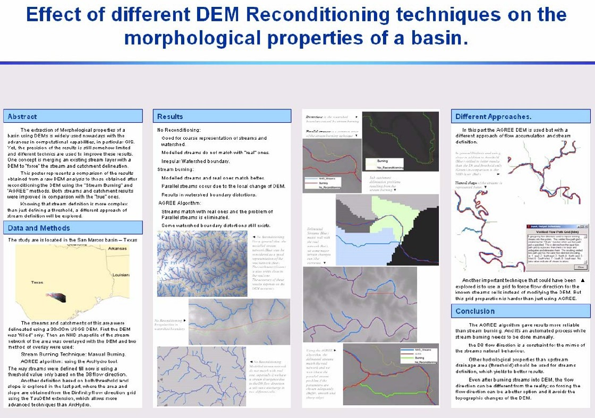
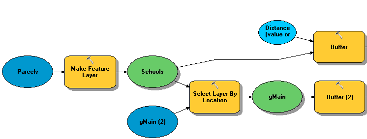

# Applied GIS (GEOG 489)
**Week 1: Course Introduction**
Slides of this class: https://git.io/vMR3X

 
Instructor: Yi Qiang

Email: yi.qiang@hawaii.edu

---

# What is Applied GIS?
* How it is different from fundamental GIS?
* Examples of applied GIS?
* What do you want to learn from this course?

---
# Course Topics (tentative)
* Geoprocessing using ArcGIS (2 Weeks)
* Suitability Modeling (2 Weeks)
* Land cover change modeling (2 Weeks)
* Terrain and watershed analysis (2 Weeks)
* Spatial Interpolation (2 weeks)
* Advanced spatial analysis (2 weeks, TBD)
---

# Approaches to Lectures & Labs
- A bit of theory on certain new topics
- More focus on applications and case-studies
- Review / demonstration of particular GIS analysis or software skills on as-needed basis 
- Compared to the other GIS courses, there will be much more time to work on lab assignments during scheduled class time
- Develop research ability through proposal/report writing and project presentation.

---
# Course Material
* Slides, lab instructions and assignments can be accessed from 
	https://github.com/qiang-yi/GEOG489
* Lab assignments, project reports should be submitted to the course site in Laulima.
---

# Readings
- Several required readings for each topic - most are journal articles
- Text book is not necessary - but some chapters are recommended to read.
- Most of the readings are closely related to the lab assignments - we can't cover all the advanced techniques from the literature, but doing the readings will help with the lab assignments, in particular answering the questions 
- Some readings use very advanced statistical methods or other non-GIS techniques - don't worry, you don't have to understand the nuts and bolts of each method - focus on the GIS elements
---

# Expected Knowledge: ArcGIS
* Basic knowledge of ArcGIS is required 
    - Support will be provided by the instructor on a as needed basis. 
    - Learn to find solutions to your problems from the Internet, e.g. ESRI training/documentation, Stack Overflow and Google. 
* A basic knowledge of Spatial Analyst is required -we'll do more advanced stuff throughout this course.

---

# Expected Knowledge: Vector and Raster Analysis Tools
Vector analysis tools | Raster analysis tools
--- | ---
Query (spatial/attribute) | Raster calculator
Join/relate|Map algebra
Buffering| Reclassification
Dissolve| Distance functions
Merge| Zonal statisitcs
Intersect|Neighborhood
Union| Surface interpolation
... | ...
---

# Expected Knowledge: Statistics & Remote Sensing
* Hands-on Knowledge of basic statistics is required, for example, exploratory statisitc analysis or simple linear regression analysis.
* Knowledge of advanced statistics will help with readings, but is not required.
* Knowledge of remote sensing is not required but useful.
---

# Lab Assignments
* Important part of this course
    + Learning-by-doing is essential for developing GIS skills
    + Reflect in 60% of final grade
* Assignments contain
    + Limited step-by-step software instructions
    + Questions ranging from fairly basic to very advanced
    + Some questions that are open-ended
    + Some parts that are optional
* Lab assignments broken up in many small parts - if you get stuck somewhere, you can skip ahead to another part without having to wait for instructor feedback
---

# Suggestions for Lab Assignments
* Don't leave the assignments to the last minute.
    + You can't precisely estimate the time to finish it.
    + Doing assignment along with classes can help you better understand the classes and save your time
* Try to get work done during the scheduled class times, and ask questions. 
* If you get stuck with something, contact the instructor or TA - don’t struggle too long on your own.
    + During class 
    + E-mail 
    + Office hours or by appointment
---
# Project Guidelines
* The emphasis should be on using GIS as a problem solving, analytical or research tool. 
* While some data collection effort is OK, most (if not all) of your data should already exist in usable form – at least 2/3 of the project time should be spent on analysis 
* You are welcome to explore other spatial modeling software, so you are not limited to ArcGIS, or to even to using only GIS software.
---
# Project Topics 
* You will choose your project topics by: 
    + Option 1: Select from a set of suggested projects  
    + Option 2: Expand on an existing lab assignment 
    + Option 3: Develop your own project
---  

# Option 1: Suggested Project Topics (1)
* Advanced suitability modeling – More advanced techniques needed. 
* Least-cost path and corridor analysis for conservation – Developing a technique to determine the most appropriate linkages between existing conservation areas. 
* Land cover change modeling – Deriving transition rules from a time series of images and simulating land cover change using these rules.
* Sea level rise impact and social vulnerability analysis - Estimate infrastructure or population at risk of future sea level rise and evaluate the impact.
* Advanced terrain analysis techniques - flow routing, DEM reconditioning, depression removal.
---
# Option 2 
* Expand on lab assignments 
    + Expand upon the analysis in one of the lab assignments using the existing data; 
    + Applying a similar analysis to another dataset; 
    + Combing various analysis techniques with new and/or existing data into a new exercise. 
* The key requirement here is that you truly expand upon the existing exercises, in terms of data complexity or analysis techniques.
---
# Option 3 
* You are free to develop a project of your own
	+ Within the scope of GIS - but you can use GIS to solve problems in other areas 
  	+ Mainly use methods introduced in this course - but you can combine with other methods; 
  	+ Need explicit problem to be solved, logical methods and reasonable interpretation/conclusion.
  	+ Most of your data should be (almost) ready to use - don't spend most of your time on data collecting and cleaning.

---

# Project Deliverables 1
* Project Proposal (less than 1 page) 
    + Motivation for doing this project (4-5 sentences). Include any relevant citations/figures.
    + A clearly stated hypothesis (1-2 sentences).
    + An outline of the datasets you need and methods to analyze them.
---
# Project Deliverables 2
* Project Report (Maximum 6 pages, excluding references) 
    + Background (~ 0.5 page): Motivation of problem
    + Hypothesis (~ 0.5 pages): Succinct statement of problem
    + Methodology (~ 1 pages): Appropriate use of GIS
    + Results (~ 1 pages): Do results address hypothesis
    + Discussion and Conclusions ( ~ 1 - 2 pages): Interpretation of results, conclusions of the study
    + Future Work (~ 0.5 pages): Next steps
---
# Project Deliverables 3 & 4
* Poster
    - A succinct and comprehensible version of project report - documenting all major components in project report.
    - Consider how to deliver information efficiently and effectively in a limited space.
    - Size proportional to 4' * 6' (landscape layout), in PDF
    - All contents visible for people standing 6' away 
* Project presentation 
    + <=20 mins in total (<=15 mins for presentation  and <=5 mins for Q&A and transition) 
---

---

## Project Timeline
* Project proposal due: Week 7 
    - Submit Word/pdf file to laulima
    - Feebacks will be given before spring break
* Report submission: Week 15
    - Submit word/pdf file using laulima
* Poster submission: Week 15
    - Submit word/ppt/pdf file using laulima
* Project presentation: Weeks 16-17
    - Submit ppt/pdf file using laulima
---
## Course Grading
|Items|% grade|
|------|------|
|Project proposal|10%|
|Project report| 40%  |
|Poster| 20%  |
|Project presentation| 30%  |
---

## Geoprocessing Model and ModelBuilder in ArcGIS
* Geoprocessing model: 
	* a workflow consists of one or more multiple geoprocessing tools
	* The geoprocessing tools are connected by their interfaces (input and output variables)
	* represent a meaningful spatial analysis in a logical order

A geoprocessing model

---

# ModelBuilder
* Visual programming language/platform that enables you to create a program without writing code.
* You create a program by adding data and tools and connecting them into a workflow.
* Models created by ModelBuilder is explicit, automated, re-usable and sharable.
---

# Elements in ModelBuilder

**Variable**: Input and output of tools
**Tool**: a wrapped program that operate a certain analysis task
**Connector**: Connecting **data, environment, precondition and feedback** with tools
**Iterators**: ***for*** and ***while do*** loops 

![alt text][logo]

[logo]: ../labs/lab1_data/misc/Elements.png "Logo Title Text 2"

---

## Lab Computer Account
* Your account name is **the initial of your first name plus your last name, all in lower case.**
* The temporary passowrd is **change**
* In the drop list of Log on to, please select **Cartography**. If this is the first time for you to use your account, you will be prompted to **change your password**. Make a note of your password so that you can access it in the future with the same account.
* After logged on, you will see your personal drive on My Computer. (U:\ )

---
## Account Management
* Do NOT save your work on the desktop!!! 
* Do NOT save your work on the C drive !!! 
* Save your work on a continuous basis to your personal folder (U drive), which is essentially a network folder. 
* Use different folders to store different labs in your personal drive to easy track your work.
---
## Using Relative Path for Your ArcGIS Projects !!!
* If you move data between computers, you will have to use relative path names for your ArcMap documents 
* For ArcGIS 10.X, you can change the path setting by click File->Map Document. Check Store relative pathnames to data sources.
---

## Lab 1 (part 1): Building Models for GIS Analysis Using ArcGIS
Please complete the lab exercises following the instruction and finish the lab assignment.
* Lab instruction: https://git.io/vMR3W
* Lab assignment: https://git.io/vMR5c

**The assignment should be submitted to Laulima by Fri. Jan. 27.**

---

