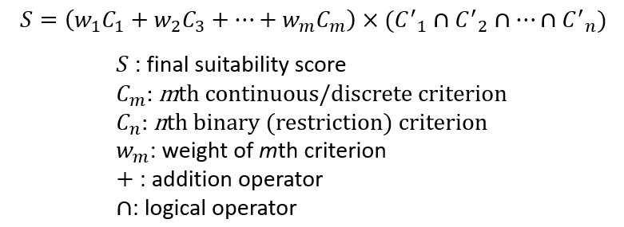

<!-- $theme: gaia -->

# Applied GIS (GEOG 489)
**Week 3: Suitability Analysis**
Slides of this class: https://git.io/vDvsA

 
Instructor: Yi Qiang

Email: yi.qiang@hawaii.edu

---

# Suitability Modeling
* “Classic” example of applied GIS
* Very well established technique
* Applications in many different fields
* Other terms:
	* Multi-Criteria Evaluations (MCE)
	* Weighted Linear Combinations (WLC)
	* Site (location) selection
---
#### Example 1: finding suitable locations for development/infrastructure

---
#### Example 2: finding suitable habitat for animal or vegetation

---
#### Example 3: finding suitable site for business

---

# Basic Steps
* #### Define criteria (factors that affect the suitability)
* #### Translate criteria into maps
* #### Standardize the criteria
* #### Determine relative importance (weight) of criteria
* #### Combine maps into a final map (using a logical order of map algebra)

---
# Step 1: Define Criteria
* ### What makes a location suitable for something?
* ### List factors of suitability
* ### Specify and quantify your criteria

---
# Question: 
## what makes a location suitable for a Starbucks?

---
# What makes a location suitable for a Starbucks?
* #### Population density
* #### Accessibility (distance to road)
* #### Income in the neighborhood
* #### Land price
* #### Close to working people /students
* ......
---
# Types of Criteria
* ### Binary criteria
* ### Discrete criteria
* ### Continuous criteria

---
# Binary Criteria
* #### Binary decision of Yes/no
* #### Represent solid requirements or constraints, e.g.	
	* must be in urban area
	* must not be on road
	* must be within 3km to river
---
# Discrete/categorical Criteria
* Usually used for cagegorical data
* Similar to Likert scale
* Assign suitability scores for different categories

|Land cover type|Suitability|Score|
|---|---|---|
|Water body|not suitable|0|
|Forest|most suitable|5|
|Grassland|very suitable|4|
|Shrubland|suitable|3|
|Bareland|maybe suitable|2|

---
# Continuous criteria
* Gradually changing suitability or preference
* The more ..., the better.
* Examples:
	* The further away from roads, the better
	* The higher prey density, the better
* Can be linear or non-linear
---
# Step 2: Mapping Criteria
* Find GIS data related to criteria
* Converting GIS data into criteria maps using appropriate spatial analysis (geoprocessing tool )

---
 ## Criterion A: must be within 100m of roads
 ## What GIS data do you need?
---
## Locations of roads (polylines)
---
* Translate roads into 'Within 100m of roads' 
* Spatial analysis (Buffer) 

---
## Criterion B: the closer to bus stops, the more suitable
 ## What GIS data do you need?

---

## Locations of bus stops (points)
---
* Translate bus stops into 'the closer to bus stops, the better' 
* Spatial analysis: Euclidean Distance
* Spatial analysis: Reclassify/Raster Calculator  

---
# Question
What GIS datatype (raster or vector) do you use to map the three types of criteria?

- Binary Criteria
- Discrete Criteria
- Continuous Criteria

---
# Question
What GIS datatype (raster or vector) do you use to represent the three types of criteria?

- Boolean Criteria
	* Vector and Raster
- Discrete Criteria
	* Vector and Raster
- Continuous Criteria
	* Raster

---
# Step 3: Standardize Criteria
* Rescale criteria to make them comparable
* Only for continuous and categorical criteria

* Easier to interpret
* You can attach importance using weight (Next step)

---
# Step 3: Standardize Criteria
* Different types of standardized scores
	* Intervals
	* Continuous
* Different functions for standardization
	* Linear
	* Non-linear

---
# Intervals Scores
* Divede criterion value into intervals
* Reclassify the intervals into discrete scores 

0 - 500 feet -> 9
500 – 1000 -> 8
1000 – 1500 -> 7
1500 – 2000 -> 6
2000 – 2500 -> 5
2500 – 3000 -> 4
3000 – 3500 -> 3
3500 – 4000 -> 2
4000 - 4500 -> 1

---
# Continuous Scores
* Rescale the range of criterion value
* e.g. linear rescale into a range from 1 to 10

(X - Min)/(Max-Min) * 10

---
# Linear standardization

(X - Max)/(Max-Min)

---
# Non-linear standardization
* Suitability is not linearly related to the criteria
* For example, 1000m is the most suitable elevation for a vegetation species, suitability decrease when elevation either increases or decreases.

---
# Determine relative importance (weight)
* Quantify the importance of factors as coefficients
* Assuming all factors are already standardized into a comparable range
* Usually based on empirical experience or personal opinion.
* Sometimes very subjective
---
# Weights are relative
* Weights are usually represented as a ratio
* Sum of all weights is 1
* Shows how much the factor weighs among all factors
* Final score is in the same range as criteria

---
# Calculating Weights

|Factors|Importance|Weight|
|---|---|---|
|Distance to road|5|5/16 (0.3150)|
|Elevation|2|2/16 (0.0625)|
|Land cover type|3|3/16 (0.1875)|
|Prey distribution|6|6/16 (0.2500)|
|Total|16|16/16 (1)|

---
# 
### Step 5: Combining Criteria Maps into Final Suitability Map

---
### Step 5: Combining Criteria Maps to Final Suitability Map
* Combine criteria maps using a equation, e.g.  

---

# Lab Exercise 2:
Please download the assignment from **https://git.io/vDeAZ**

You will do the exercises in this lab and next week's lab (no more assignment next week).

Submission due Feb. 17