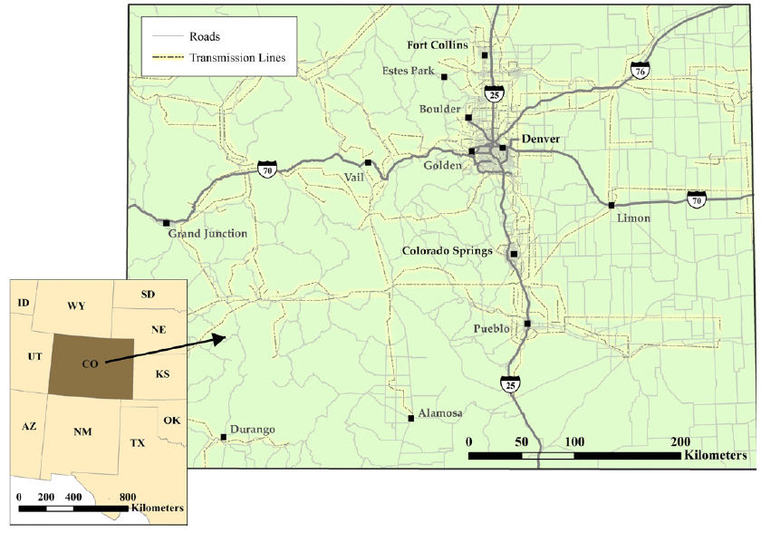
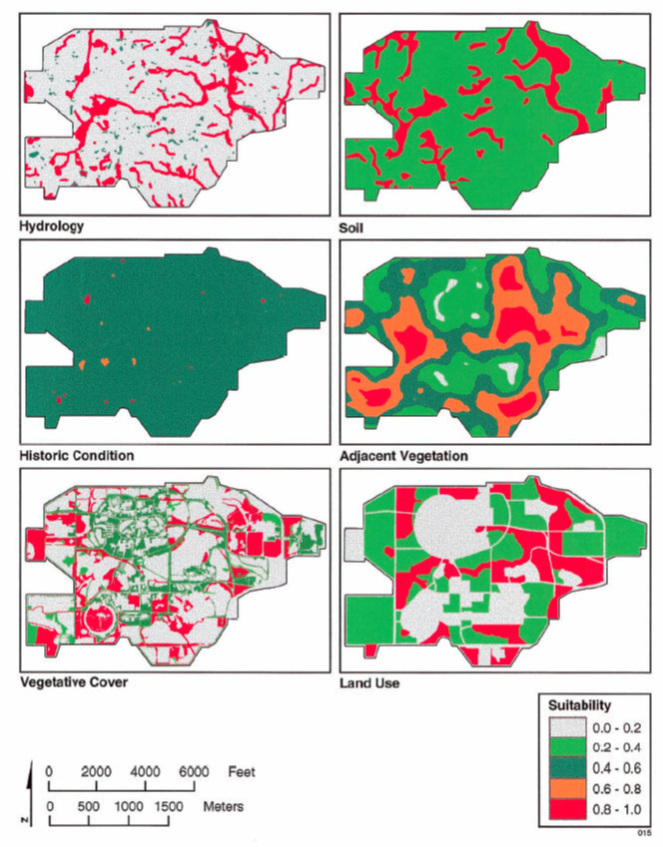
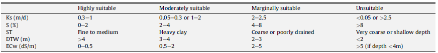

<!-- $theme: gaia -->

# Applied GIS (GEOG 489)
**Week 4: Suitability Modeling (Case studies)**
Slides of this class: https://git.io/vDG0Q

 
Instructor: Yi Qiang

Email: yi.qiang@hawaii.edu

---
# Recall: Basic steps of suitability modeling
1. Defining criteria
2. Mapping criteria
3. Standardize criteria
4. Assigning weights
5. Combining into final suitability map

---
# Example 1: Wind and solar farm

Janke, J. R. (2010). **Multicriteria GIS modeling of wind and solar farms in Colorado**. *Renewable Energy*, 35(10), 2228-2234.[pdf](../readings/suitability_modeling/Janke_2010.pdf)

---
# Objective

---
##### Study Area (Colorado)

---
# Defining Criteria

---
#### Identifying Data and Mapping Criteria

---
Authors' comment on raster and vector

---
# Mapping Criteria

---
### Standardize Criteria and Assign Weights

---
###  Final suitability score of wind farm

---
###  Final suitability score of solar farm

---
#### Example 2: Find suitable locations for wetland mitigation sites
 

Van Lonkhuyzen, R. A., LaGory, K. E., & Kuiper, J. A. (2004). **Modeling the suitability of potential wetland mitigation sites with a geographic information system**. *Environmental Management*, 33(3), 368-375.[pdf](../readings/vanlonkhuyzen.pdf)

  
Study site: DuPage County, Illinois, USA

---
Criteria and weights

---
##### Mapping Criteria

---
### Equation used to combine criteria

---
## Final output

---
# Question:
# What is the major issue of the above analyses?
---
# The linear weighted combination is too arbitary
* Subjective suitability score for each criterion
* Subjective weghts
* Subjective equation to combine criteria
* No empirical analysis
* No validation
---
# Example 3: Sensitivity Analysis

##### Test how the suitability map differs with different weights

Chen, Y., Yu, J., & Khan, S. (2010). **Spatial sensitivity analysis of multi-criteria weights in GIS-based land suitability evaluation**. *Environmental Modelling & Software*, 25(12), 1582-1591.[pdf](../readings/Chen_2010.pdf)

---
# Model to be tested 
Suitability for irritated cropping landuse in Queensland, Australia

---
# Criteria 
* Rank suitability of each criteria

---
* Define benchmark wegiths using Analytical Hierarchy Process

---
#### Simulation by changing the weight of KS

---
* Some tipping point can be found - suitability map changes significantly with only a small change of the weight 

---
## Example 4: Predict Wolf Habitat Suitability

Glenz, C., Massolo, A., Kuonen, D., & Schlaepfer, R. (2001). **A wolf habitat suitability prediction study in Valais (Switzerland)**. *Landscape and Urban Planning*, 55(1), 55-65.[pdf](../readings/Glenz_2001.pdf)

---
# Study Area

Canton of Vailas, Switzerland

---
# Criteria and data source

---
# Criteria Mapping

Data for the calculation of the wild ungulate diversity index were in **numerical and cartographical form** and have been processed for further analysis in GIS. **The habitat variables were calculated on a 4 km2 grid**, in order to consider pronounced variations of the geo-morphological conditions in the study region, as well as its environmental and demographic peculiarities.

---
# Building Equation
* An empirical study using logistic regression model
* Building relation (equation) between wolf presence and environmental variables

---
# Building Equation

---
# Estimating Wolf Presence Probability

---
#### With empirical analysis, the equation and weights are not subjective.   
#### Question: Any other issues with this approach?

---

#### Logistic regression still assumes a linear relation between suitability and criteria, which is not usually true in the real-world.

---
# Some thinkings
* What are the difference of using vector/raster in suitability modeling, and what are the pros and cons.
* What are the major issues in suitability modeling? What are the solutions?

---
# Continue Lab Exercise 2:
Download the assignment from **https://git.io/vDeAZ**

Submission due Feb. 17