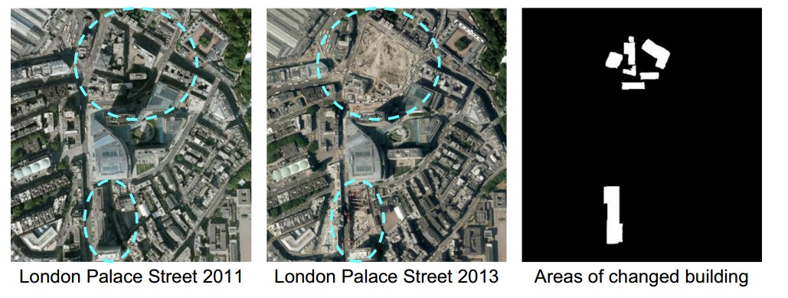

Week 5: Land Cover Change Modeling
========================================================
author: Yi Qiang
date: Feb. 10, 2017
autosize: true
font-family: 'Helvetica'
css: style.css

Space and Time
========================================================
  
# *Give me space and motion and I will give you a world*.
 
## R Decartes

Land (Use) Cover Change
========================================================

- Biophysical materials and human-made features are dynamic, changing rapidly.
- An important instrument to study interactions between natural and human systems on the earth surface.
- An important indicator and factor to climate change. 
- Significant effort has done in the development of change detection methods using remotely sensed data.

General Steps
========================================================
### 1. Data processing
  - Making images comparable (Rectification, classification, interpolation, resampling)
  
### 2. Change Detection (Exploratory analysis)
- How much and where were the changes

### 3. Change Modeling (Empirical modeling)
- How it changed and what caused the change

### 4. Change Simulation (Predictive modeling)
- How it will change in future or in other scenarios?

1. Data Processing
========================================================

- Successful remote sensing change detection requires careful attention to: 
 - remote sensor system considerations, and 
 - environmental characteristics. 
- Ideally, the remotely sensed data used to perform change detection is acquired by a remote sensor system that holds the following resolutions constant: temporal, spatial (and look angle), spectral, and radiometric.
- Many processed land cover databases are available, e.g. (NLCD, NOAA C-CAP)

1. Data Processing
========================================================
### Spatial Resolution

- Land cover change detection should be conducted among images with same spatial resolution and grid

- If not, images need to be resampled or interplated into the same resolution and grid - but this process will introduce error or information loss.

1. Data Processing
========================================================
### Temporal Resolution

- Be careful to identify the optimal change detection time period(s).
  - for instance, traffic transportation studies may require a change detection period of a few minutes.
  - You don't need daily images to study deforastration.

- Temporal resolution should be held constant during change detection, if possible. 
- Images used for change detection should be acquired at comparable times.
  - for instance,  minimize seasonal or tidal effects.
  
1. Data Processing
========================================================
### Image rectification

- Geometric rectification may be needed to eliminate systematic and non-systematic distortions caused by different RS platforms

- Radiometric correction may be needed to eliminate avoid radiometric distortions.

2. Change Detection
========================================================
# Volumne Change
  - Change of certain quanities over time
  - e.g. changes of NDVI (vegetation), impervious surface (urban), ice cap. 
  
# Spatial pattern Change
  - Changes of spatial pattern and arrangement
  - e.g. fragmentation, clustering, spatial autocorrelation.

2. Change Detection
========================================================
# Spatial relation change
  - Change of spatial or non-spatial relation with other variables
  - e.g. increasing deforastration near roads, increasing urbanization in higher elevation regions.

# Transition Frequency
  - Frequencies of different types of changes (Markov Chain)
  - e.g. what is the most frequent land cover transition, probability of a certain type of transition
  
  
Visualizing change (Image comparison)
========================================================

Visualizing change (Image comparison)
========================================================

Visualizing change (Color-code changed pixels)
========================================================

Visualizing change (Color-code changed pixels)
========================================================

Visualizing change (Color-code changed pixels)
========================================================

Animation
=========================================================
Google Earth Time Laps

- Based on time series of Landsat images
- Visually observe land cover changes over time.

https://earthengine.google.com/timelapse/

Quantitative Detection
==========================================================

Example: Land-Cover Change in Upper Barataria Basin Estuary, Louisiana, 1972-1992: Increases in Wetland Area

Nelson et al., 2002, **Land-Cover Change in Upper Barataria Basin Estuary**, Louisiana, 1972-1992: Increases in Wetland Area, *Environmental Management*, 29(5), 716-727 [pdf](../readings/LULC/Nelson_2002.pdf)

Study Area
=========================================================

Image time series
=========================================================

Changes of different land cover types
=========================================================

Rate of change
=========================================================

Transition matrix (in ha)
=========================================================

Transition matrix (in %)
=========================================================

Bottomland forest and swamp forest in Louisiana
=========================================================

New development
========================================================
## UAV
Building Change Detection using Unmanned Aerial Vehicle (UAV)

New development
========================================================
## UAV
Constructing and Comparing 3D building changes Captured by RGB-D camera

New development
========================================================
High resolution images (e.g. Digital Globe)
  - 30m resolution in 30min frequency
  - Estimate Canada's retailing industry by 'counting' cars in supermarkets' parking lots.
  - Estimate China's economy by 'counting' trucks parked in factories in southeastern China.

http://global.digitalglobe.com/interactive/30cm/

http://microsites.digitalglobe.com/30cm/

Lab Assignment 3
========================================================

Download the assignment from **https://git.io/vDRCs**

Submission due on March 3

