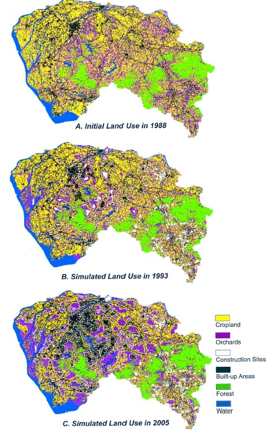

Week 6: Land Cover Change Modeling (2)
========================================================
author: Yi Qiang
date: Feb. 17, 2017
autosize: true
font-family: 'Helvetica'
css: style.css

General Steps
========================================================
### 1. Data processing
  - Making images comparable (Classification, interpolation, resampling)
  
### 2. Change Detection (Exploratory analysis)
- How much and where are the changes

### 3. Change Modeling (Empirical modeling)
- How it changed and what caused the change

### 4. Change Simulation (Predictive modeling)
- How it will change in future or in other scenarios?

3. Change Modeling
========================================================
- Quantify the relation between the driving forces and changes
  - Empirical study based on past changes
  - What factors caused the changes?
  - Quantify the relation into certain types of equation or rules
  - Need statistical or data mining techniques

Statistic Approach
========================================================
## Pchange = f(x1,x2,...x3)

- Multiple (logistic) regression
- Linear relation between change probability and driving factors
- Pro: easy to interpret (white-box), easy to compute and implement
- Con: assume normal distribution, linear relations, no colinearity, unable to deal with complex relations.

Machine Learning
=========================================================
- Artificial intelligence, optimization techniques based on heuristic algorithm
- For example, neural network, decision tree, random forest, genetic algorithm, support vector machine, simulated annealing, ant colony optimization
- Pro: 
  - better performance for non-linear, complex relations.
  - No assumptions on normal distribution and non-colinearity
- Con:
  - Black-box, do not explain internal mechanism
  - Computational intensive
  - Overfitting

Markov Chain
=========================================================
- Quantify the probability of change from State A to B
- Based on frequencies of past changes (transition matrix)

More about Markov Chain:
http://setosa.io/ev/markov-chains/

4. Change Simulation
========================================================
- Predict land cover change in future or other scenarios
- Based on an empircal model derived from past changes
- Sometimes have multiple iterations (Cellular Automata)
- Can be stochastic (include randomness)

4. Change Simulation
========================================================
### Using transition rules derived from t1 to t2 predict land cover at t3

## One-step simulation
- Result is usually a change probability map - similar to suitability modeling

## Iterative simulation
- Run simulation in multiple steps
- The status of current step is based on the previous step
- Model dynamic changes with local interactions
- Usually is a stochastic process
- Commonly used technique: cellular automata

Cellular Automata
========================================================

Urban growth simulation using CA
=======================================================

https://www.youtube.com/watch?v=FQ7LNtmVEAM

Wildfire simulation using CA
========================================================

Example 1
========================================================
   
### Wu, F. (2002). Calibration of stochastic cellular automata: the application to rural-urban land conversions. *International Journal of Geographical Information Science*, 16(8), 795-818.

An Example of Land Cover Modeling
========================================================

Study area: Tianhe District, Guangdong Province, China

Urban morphology
=========================================================

Urban sprawl and spill-over
=========================================================
### Both sprawl and spill-over patterns in urban morphology

Urban sprawl and spill-over
=========================================================
### Both sprawl and spill-over patterns in urban morphology

Transition Function
========================================================
- Global development suitability
- Local neighborhood effect
- Constraint
- Stochastic component

Three different simulations
=========================================================
- Only global development suitability 
- Only local neighborhood effect
- Both global suitability and neighborhood effect

Simulation 1
=========================================================
- Predict urban growth with only global suitability
- Fitting the variables into a logistic regression model

Simulation 1
=========================================================
Derived coefficients of the logistic regression model

Development suitability (probability) 
=========================================================
Calculated from the logistic regression model

Urban growth predicted by only development suitability
=========================================================

Urban growth predicted by only neighborhood effect
=========================================================

Prediction by both global suitability and neighborhood effect
=========================================================

Prediction accuracy of the three simulations
=========================================================

Example 2
=========================================================
  
### Li, X., & Yeh, A. G. O. (2002). Neural-network-based cellular automata for simulating multiple land use changes using GIS. *International Journal of Geographical Information Science*, 16(4), 323-343.

Multiple land use changes
==========================================================

Multiple land use changes
==========================================================

Variables used for modeling
==========================================================

The modeling process
==========================================================

ANN calibration
==========================================================

Model Validation
==========================================================

Simulation result
==========================================================

Simulation result
==========================================================

Some announcements
==========================================================
1. You will need to print your poster in a 40"(height)*60"(width) dimension for your final project
2. There will be no class on April 7th - I'll set up a Doodle pool for a make-up date.

Lab Assignment 3
========================================================

Download the assignment from **https://git.io/vDRCs**

Submission due on March 3
