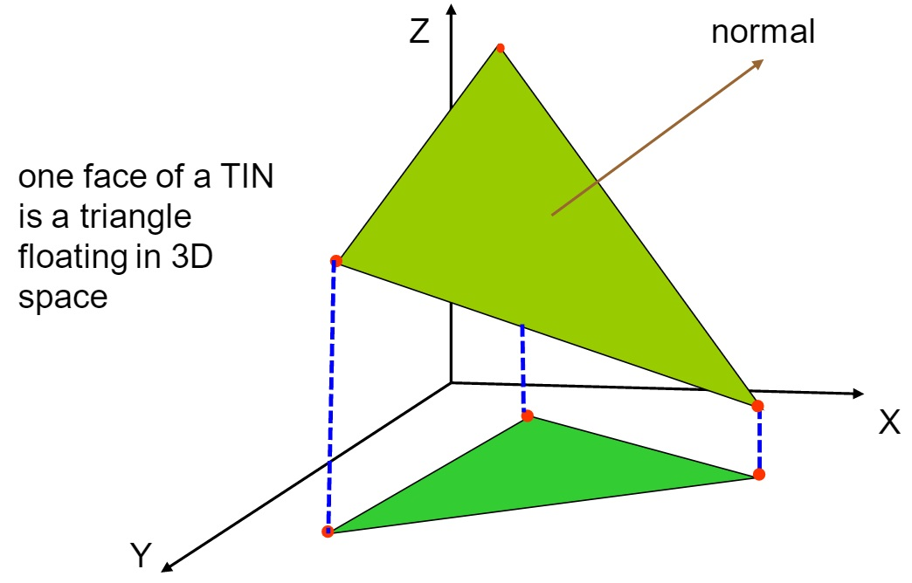

Week 7: Terrain Analysis
========================================================
author: Yi Qiang
date: Feb. 24, 2017
autosize: true
font-family: 'Helvetica'
css: style.css

Terrain Analysis
========================================================
- The Earth Surface is not flat

Terrain Analysis
========================================================
- In addition to X, Y, there is Z (height)
- Also called 3D Analysis

Why analyze terrain?
========================================================
- Different types of terrain - different patterns of X, Y, and Z
- Formed by different processes - geological, hydrological, and volcanic
- [Human activities (anthropocene)](http://anthropocene.info/)
 

Why analyze terrain?
========================================================
Spatial metrics, such as distance, area and volumne

 
 
Why analyze terrain?
========================================================
Surface adjusted distance

Why analyze terrain?
========================================================
hydrological modeling
 

Why analyze terrain?
========================================================
Landslide modeling

Why analyze terrain?
========================================================
Suitability modeling

Modeling Surface in GIS
=========================================================
## Two Most Common Terrain Data Models:

- Digital Elevation Data (DEM) (Raster)
- Triangular Irregular Network (TIN) (Vector)

Digital Elevation Model (DEM)
=========================================================
- DEM is basically a normal raster of elevation -it's called DEM because it is specific for a topographic surface 
- A DEM is the simplest form to represent a topographic surface
- One of the most widely used data layers in many GIS applications
- The critical parameter is the resolution (or grid cell size)
- 1m resolution DEM for HI, 30m resolution for the US and 1km resolution for the globe are freely available

Digital Elevation Model (DEM)
=========================================================
Essentially a raster of elevation (2D matrix)

Digital Elevation Model (DEM)
=========================================================
DEM in 3D

Triangular Irregular Model
=========================================================

A vector model for 3D terrain

Triangular Irregular Model
=========================================================
Delaunay Triangulation between sampling points

Triangular Irregular Model
======================================================
A facet of TIN in 3D

Triangular Irregular Model
======================================================
Resolution of TIN - number of triangles

Basic Terrain Analysis
=========================================================
- Surface-adjusted metrics (distance and area)
- Slope (Landslide susceptibility)
- Aspect (Solar insolation, vegetation)
- Profile (elevation change along a line)
- Viewshed (visibility)
- Hillshade (visualization)
- Area solar radiation
- *Flow path, watershed delination, flow accumulation (hydrology)*
- *Indices (e.g., terrain ruggedness)*

Distance calculation in DEM (Pixel-to-pixel approach)
=========================================================
- Convert a vector line to a raster line
- The sum of actual run between every pair of adjacent pixels

Distance calculation in DEM (Sampling approach)
=========================================================

- Define sampling points along a transect
- The sum of distance between each pair of points

Distance calculation in TIN
=========================================================

- Define a number of sampling points along a transect
- The elevation of a point is estimated from the triangle it is located in or the surrounding triangles
- The sum of distance between each pair of sampling points

No guidelines of distance calculation
=========================================================
- ~ 10 different measurement approaches
- Caculation accuracy = f(DEM/TIN resolution, landscape, interpolation method, sampling size)
- Trade-offs between accuracy and data size, accuracy and computation time.

Area caculation
=========================================================

Surface adjusted area is the total area of all the triangular facets

Slope Calculation
=========================================================
- Angle of the slope (degree)
- Ratio of the slope (percentage)

Calculate slope in DEM
=========================================================

- In DEM, maximum rate of change in value from that cell to its neighbors. 

Slope calculation in ArcGIS
=========================================================
Geometric combination of vertical (x direction) descent and horizontal (y direction) descent  

Calculate slope in DEM
=========================================================
Elevation to Slope

Aspect
=========================================================
- The direction of the slope 

 

Profile
=========================================================
Most GIS packages provide tools for examining the profile of a surface along a selected straight line or series of straight line segments (polyline).

Profile
=========================================================
Profile along multiple straight transects

Profile
=========================================================
- Profile of a path/route

Viewshed
=========================================================
- Areas visible to a set of observer features.
- Viewshed tool in ArcGIS

Viewshed
=========================================================
- Listening Posts/Observation Posts (LP/LO)
- Weapons placement
- Antenna placement for radar, radios, or cell phones
- Special surveillance equipment placement

Hillshade
=========================================================
- Hypothetical illumination of a surface by determining illumination values for each cell in a raster
- Enhance the visualization of a surface for analysis or graphical display
- Parameters: altitude and azimuth

Altitude (Hillshade)
==========================================================
- The altitude is the angle of the illumination source (e.g. the sun) above the horizon. 
- The units are in degrees, from 0 (on the horizon) to 90 (overhead). The default is 45 degrees.

Azimuth (Hillshade)
==========================================================
- Azimuth is the angular direction of the sun, measured from north in clockwise degrees from 0 to 360. 
- An azimuth of 90 degrees is east. The default azimuth is 315 degrees (NW).
- Why default azimuth is 315 (NW), given most people are living in the North Hemisphere where the Sun azimuth is South?

Hillshade
==========================================================
## Sink or hill?

Hillshade
==========================================================
## Sink or hill?

Hillshade
==========================================================
Original DEM - hill  

Hillshade
=========================================================
- Combining viewshed with elevation

Solar Radiation Analysis
=========================================================
Cumulative solar radiation in a day (Area Solar Radiation tool in ArcGIS)

Viewshed
=========================================================
Solar Radiation: Summer Solstice

Viewshed
=========================================================
Solar Radiation: Winter Solstice

Anouncement
=========================================================
Change of topics:
Topic 5: Spatial Interpolation -> Hazard risk and vulnerability assessment
Topic 6: Advanced spatial modeling -> Web mapping
Next class -> Project discussion

Lab 4 Assignment (Terrain analysis)
=========================================================

Due date March 17

[https://github.com/qiang-yi/GEOG489/blob/master/labs/lab4_terrain_analysis.docx](https://github.com/qiang-yi/GEOG489/blob/master/labs/lab4_terrain_analysis.docx)
