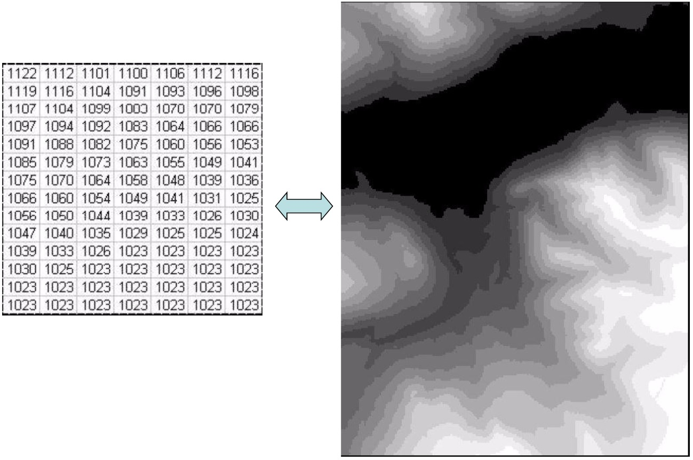

Week 9: Watershed Analysis (2)
========================================================
author: Yi Qiang
date: Mar. 10, 2017
autosize: true
font-family: 'Helvetica'
css: style.css

Stream and Watershed Delineation
========================================================
Flow direction
Flow accumulation
Stream delineation
Stream network/order
Watershed delineation

What is watershed
========================================================

Definition: An area of land where all of the water that falls in it and drains off of it goes to a common outlet.

What is watershed
========================================================
A hierachical system - 6 levels in the U.S. (Hydrologic Unit Code)
  - regions, subregions, basins, subbasins, watersheds, and subwatersheds

Watershed delination in a contour map
========================================================
General steps:
  1. Determine the outlet point (mark as a circle)
  2. Identify high points around the upperstream of the outlet point (mark as crosses)
  3. Starting from the outlet point, drawing a line to link all high points (crosses)
    - The line should be in the right angle to the contour lines

Watershed delination in a contour map
========================================================

Watershed delination in digital elevation model
========================================================
How to delineate watershed in DEM

Watershed delination in digital elevation model
========================================================
General steps:
  1. Pit/Peak filling - remove error pixels
  2. Flow direction - where water flow at each pixel
  3. Flow accumulation - water in how many pixels will eventually flow to this pixel
  4. Watershed and stream delineate
  
Pit/peak filling
=======================================================
- Sinks (and peaks) are often errors due to the resolution of the data or rounding of elevations to the nearest integer value. (Fill tool in ArcGIS)
- Sinks & peaks should be filled to ensure proper delineation of basins and streams. If the sinks and peaks are not filled, a derived drainage network may be discontinuous.

Pit/peak filling
=======================================================

Pit/peak filling
=======================================================

Flow direction
=======================================================
The direction from each cell to its steepest downslope neighbor. 
Coded as: 2x (x=1,2,... 8) from east and clockwise   

Flow direction
=======================================================
  1.Identify the neighbor pixels with lower elevation than the central pixel
  2.Calculate the downslopes, find the neighbor pixel with highest downslope rate.
  Note: different from aspect

Stream delineation
=======================================================
Linking cells by their flow directions

Stream delineation
=======================================================
1. Flow accumulation - the number of pixels flowing into the pixel
2. Stream delineation - All cells with flow accumulation above a threshold form a stream (Reclassify or Raster Calculator)

Stream segmentation in DEM
=======================================================
Numbering streams in a stream raster

Stream delineation
=======================================================

Stream network and order
=======================================================
- Stream network is hierachical
- Strahler method: The stream order increases when streams of the same order intersect. Otherwise, the higher-order stream continues. (Stream Order tool)

Watershed delineation
=======================================================
1. Identify watershed outlet (pour point) - Snag to pour point tool in ArcGIS

